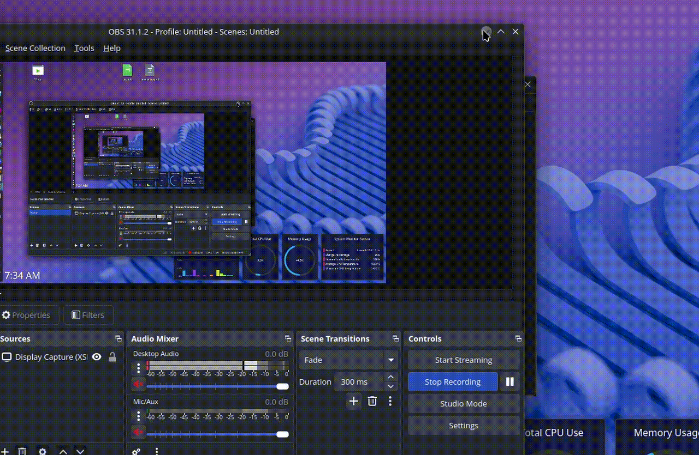

# Build dependencies

[just](https://github.com/casey/just), [rust toolchain](https://www.rust-lang.org/tools/install) and [Qt6 Framework](https://qt-project.org/) are needed for build:

First install rust toolchain.

Then you can install just:
```
cargo install just
```

And Qt6 Framework:
 - Debian: `sudo apt install qt6-base-dev`
 - Arch: `sudo pacman -S qt6-base`

# Build

```shell
just build # build
just run   # run the binary
just br    # build & run
just clean # clean build assets
```

Note: the built binary will be located at `./build/Bed`

# [WIP] Build Qt6 lib Windows sources using MXE

```
sudo pacman -S mingw-w64-gcc
```

clone mxe repo

```
git clone https://github.com/mxe/mxe.git
```

install dependencies needed to build w/ mxe

```
sudo pacman -S p7zip gperf intltool lzip python-mako ruby base-devel gettext libiconv glib2-devel
```

build qt windows dependencies

Note: I had to apply [this patch](https://github.com/mxe/mxe/issues/3234#issue-3129443422)

```
cd mxe
MXE_TARGETS='x86_64-w64-mingw32.static' make -j$(nproc) qt6-qtbase
```

NOTE: stopped here as it build 32bits sources when asked 64bits, openened an issue on the mxe repo
```
make qt6-qtbase MXE_TARGETS='i686-w64-mingw32.static x86_64-w64-mingw32.static'
```

# [WIP] Build Qt6 lib Windows from git repo

## Install dependencies

```
sudo pacman -Syu base-devel libxcb libx11 glu libxrender libxi libxkbcommon libxkbcommon-x11 flex bison gperf icu libxslt ruby openssl libxcursor libxcomposite libxdamage libxrandr dbus fontconfig libcap libxtst pulseaudio systemd pciutils nss alsa-lib libxss mesa gstreamer gst-plugins-base perl python
```
